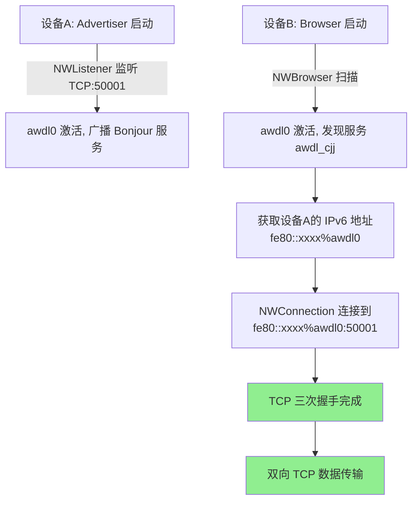
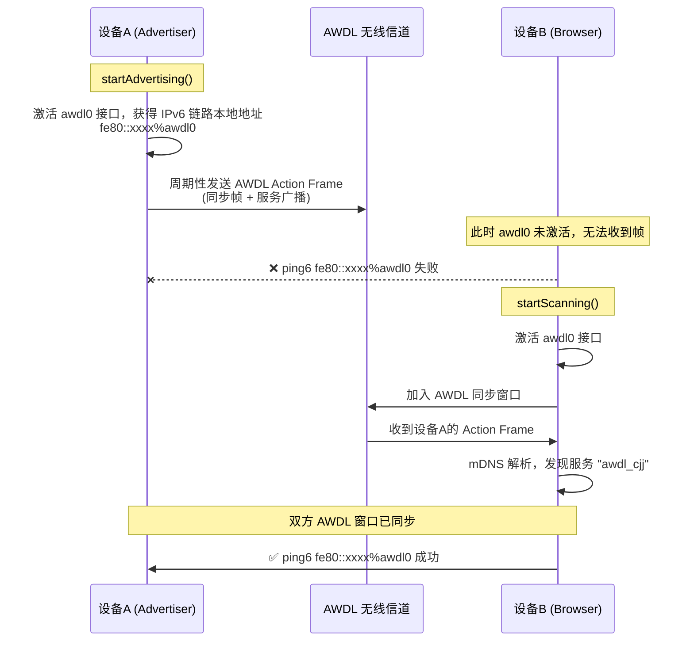

# AWDL协议通信

## 介绍

本分支是基于swift实现的，OC的实现见[OC_implement分支](https://github.com/cuijunjie18/awdl_connect_NW/tree/dev/oc)

## 框架

- 网络核心框架：
  - 使用了Apple的官方Network框架,代替旧的Foundation中的NW相关api
  - 使用了POSIX标准的C调用，用于实现ipv6 TCP通信
- UI框架：Swift UI

## 业务流程

## 目前代码可能存在的问题

- [ ] 获取awdl接口对应的ipv6地址时，认为一定是awdl0接口，这个在某些情况可能会异常
- [ ] 目前的测试是默认激活了awdl接口，实际上应该等advertiser start后，去动态更新广播的内容(NW框架无法做到)

## 收获

### 一、项目awdl连接原理

### 二、socket需要绑定awdl接口的原因

两台 Apple 设备通过 AWDL（Apple Wireless Direct Link）协议互相发现，能 ping6 通，但 TCP 连接建立失败（卡在 connect() 调用）。

根本原因：Socket 未绑定到 awdl0 接口
AWDL（awdl0）是 Apple 平台上的一个特殊的点对点网络接口，它不在系统的默认路由表中。这意味着：

Server 端：虽然使用 in6addr_any 监听"所有接口"，但系统不会自动将 awdl0 纳入监听范围。Server 的 socket 实际上只在 Wi-Fi/以太网等常规接口上监听，awdl0 上的连接请求根本到不了 Server。

Client 端：虽然正确设置了 sin6_scope_id（指定了目标地址的接口索引），但 client socket 本身没有绑定到 awdl0 接口。系统在路由决策时不知道应该通过 awdl0 发送 TCP SYN 包，导致 connect() 超时或失败。

附带问题：tcp_client_connect 在主线程上被阻塞调用，会导致 UI 卡死。

这就是为什么 ping6 能通但 TCP 连不上的原因——ping6 <ipv6>%awdl0 命令显式指定了接口，而你的 TCP 代码没有。